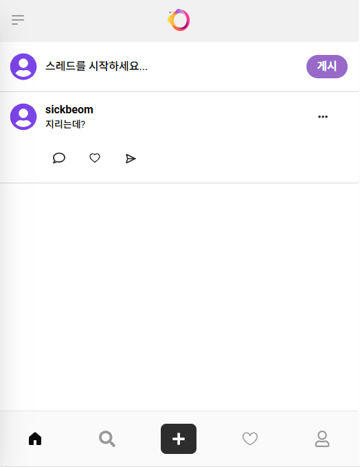
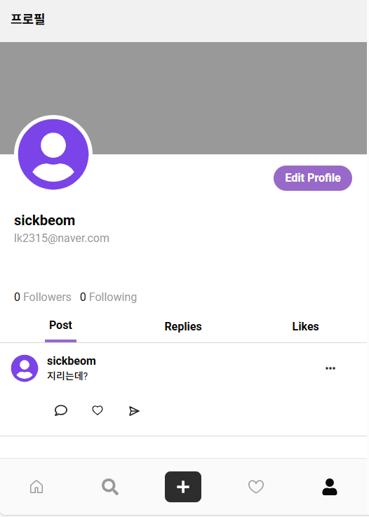
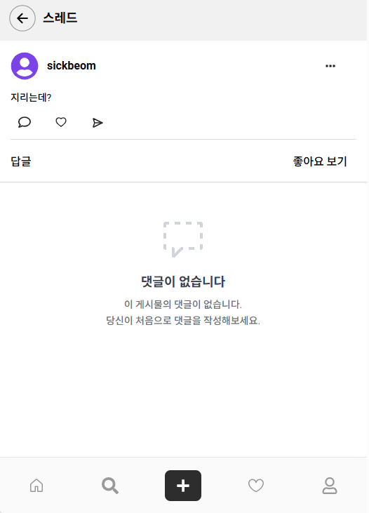
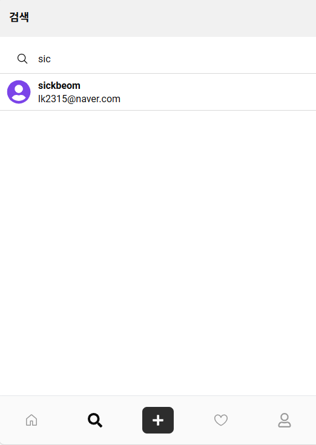
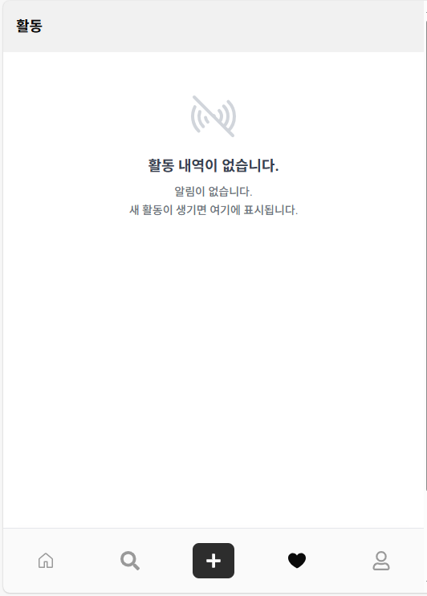
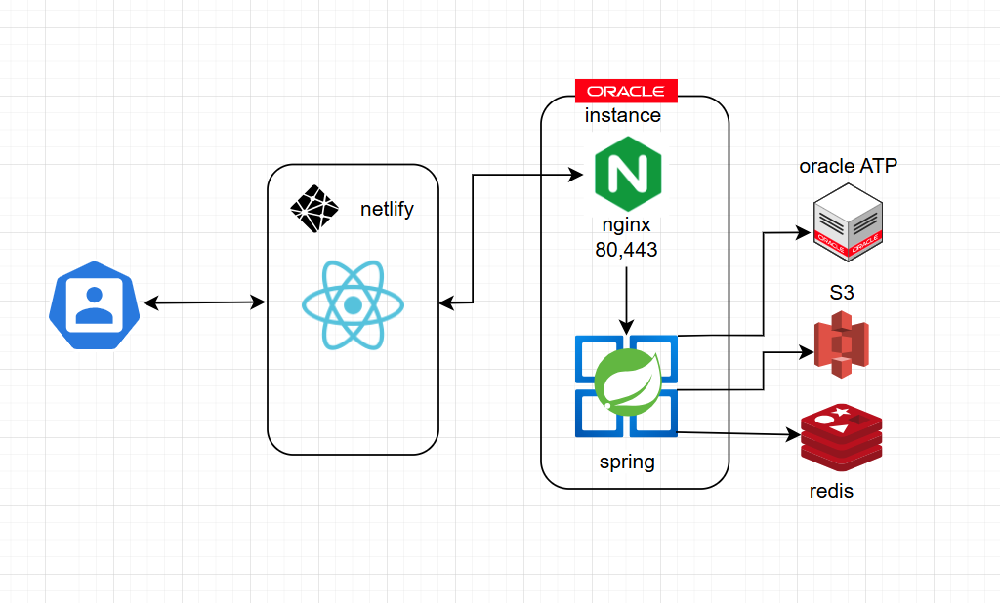

# Clipo-SNS-Project
- springBoot + React  
SNS 웹 + 모바일 프로젝트 입니다.  

## 🖥️ 프로젝트 소개
Thread Instagram 를 참고하여 만든 SNS 사이트입니다.  
배포하여 주변 지인들과 함께 일상을 공유하는 앱을 만들고자 개발하였습니다.
링크 : https://clipofront.netlify.app/
 

## 🕰️ 개발 기간
* 24.06.26일 - 진행중

### 🧑‍🤝‍🧑 맴버구성
 - 팀원1  : 홍희범 - JavaSpringBoot 
 - 팀원2  : 유현우 - React

### ⚙️ 개발 환경

### 📌 사용 기술
- Spring Security (인증/인가)
- JWT + OAuth2 (소셜 로그인)
- AWS S3 (이미지 저장)
- Redis (문자 인증)
- SMS API (회원가입 인증)
- SSE (실시간 알림)
- Swagger (API 문서화)

## 📌 주요 기능

| 기능            | 설명 |
|-----------------|------|
| **로그인**       | JWT 로그인, OAuth2 소셜 로그인, 토큰 검증, ID/PW 찾기, 쿠키/세션 발급 |
| **회원가입**     | 아이디 중복 체크, Redis 기반 문자 인증 |
| **마이페이지**   | 회원 정보 변경, 나의 게시글 및 댓글 관리 |
| **게시글 관리**  | 게시글 CRUD, 이미지 업로드, 태그 작성, 좋아요/댓글 기능 |
| **메인 페이지**  | 최신순 게시글 목록, 게시글 작성 |
| **검색 기능**    | 사용자, 태그, 게시글 검색 |
| **알림 기능(SSE)** | 팔로우/좋아요 알림, 팔로잉 계정의 활동 알림, 알림 기록 조회 |

---
## 🗒 ERD

## 🖼️ View
- 메인 페이지

- 마이 페이지

- 게시글

- 검색

- 활동

- 
## 📁 프로젝트 구조

## 🌟 문제 해결
[트러블슈팅 - Google Drive.pdf](https://github.com/user-attachments/files/21357551/-.Google.Drive.pdf)

